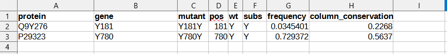

# Scraping Protein Abundance along with Epidermodysplasia Verruciformis Mutation Effects

<br>
<p align="center">
  
</p>
<p align="center"><em>Source: pax-db.org</em></p>

## Overview
This repository houses a pair of Python scripts designed to harness protein data from web sources. The first script is dedicated to the extraction of protein abundance averages, a crucial aspect of biological research, from the Database of Protein Abundance Averages Across All Three Domains of Life, commonly known as 'Pax-DB'. The second script in this repository is tailored for the extraction of mutation effects data associated with Epidermodysplasia Verruciformis (EV). This condition is characterized by its association with human papillomavirus (HPV) and its effect on the skin, often leading to wart-like growths. The data related to EV mutation effects is sourced directly from datasets maintained by Harvard Medical School (HMS). 

## Table of Contents
- [Overview](#overview)
- [Installation](#installation)
- [Usage](#usage)
- [Demo](#demonstration)
- [Contributing](#contributing)
- [License](#license)

## Installation

To use these scripts, you'll need Python installed on your system. Additionally, you may need to install some Python packages to run the scripts. You can do this using pip:

```bash
pip install -r requirements.txt
```

## Usage
Clone the repository to your local machine and navigate to the repository's directory:

```bash
git clone https://github.com/TimG26/genome-data-scraper.git
cd genome-data-scraper.git
```

The `Protein_abundance_averages.py` script is designed to extract protein abundance averages from Pax-DB by first retrieving the gene name of the protein from The Universal Protein Resource (UniProt). This data can be useful for various biological and research applications. 

```bash
python Protein_abundance_averages.py
```

The `Epidermodysplasia_verruciformis.py` script is dedicated to extracting mutation effects data associated with Epidermodysplasia Verruciformis (EV). It does so by downloading mutation data provided by Harvard Medical School (HMS). This information can be crucial for understanding the genetic factors behind EV. Run the following commands :-

```bash
python Epidermodysplasia_verruciformis.py
```

## Demonstration
<p align="center">
  
</p>
<p align="center"><em>Working of the Protein_abundance_averages.py script</em></p>
<br>

<p align="center">
  
</p>
<p align="center"><em>Working of the Epidermodysplasia_verruciformis.py script</em></p>
<br>

<p align="center">
  
</p>
<p align="center"><em>CSV file generated from the Protein_abundance_averages.py script</em></p>
<br>

<p align="center">
  
</p>
<p align="center"><em>CSV file generated from the Epidermodysplasia_verruciformis.py script</em></p>

## Contributing
If you would like to contribute to this project, please open an issue or create a pull request. We welcome your suggestions and improvements.

## License
This project is licensed under the GNU Affero General Public License v3.0 License - see the `LICENSE.md` file for details.
